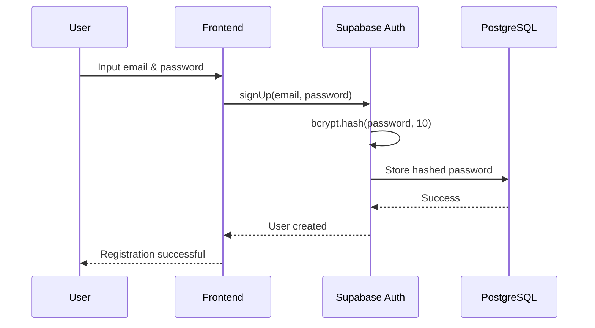

# Implementasi Bcrypt untuk Password di Lendana Financial Access Platform

## 📋 Ringkasan

Aplikasi Lendana Financial Access Platform menggunakan **Supabase Authentication** sebagai sistem autentikasi utama. Supabase Auth secara default menggunakan algoritma **bcrypt** untuk hashing password dengan cost factor 10, yang merupakan standar industri untuk keamanan password.

## 🔐 Arsitektur Keamanan Password

### 1. Teknologi yang Digunakan

- **Supabase Auth**: Layanan autentikasi managed yang menangani hashing password
- **Bcrypt Algorithm**: Algoritma hashing password dengan salt otomatis
- **Cost Factor**: 10 (default Supabase, setara dengan 2^10 = 1024 iterasi)
- **PostgreSQL**: Database untuk menyimpan hash password di tabel `auth.users`

### 2. Flow Autentikasi



## 💻 Implementasi Kode

### Sign Up (Registrasi User)

**File**: `src/lib/supabase.ts`

```typescript
export const signUp = async (
  email: string,
  password: string,
  role: string,
  fullName: string,
  agentCompanyId?: string,
  bankId?: string,
  branchId?: string,
) => {
  // Supabase Auth secara otomatis melakukan bcrypt hashing
  const { data, error } = await supabase.auth.signUp({
    email,
    password, // Password plain text dikirim ke Supabase
    options: {
      data: {
        role,
        full_name: fullName,
      },
    },
  });

  if (error) throw error;

  // Proses tambahan: membuat profil user di public.users
  if (data.user) {
    const { error: profileError } = await supabase.from("users").insert({
      id: data.user.id,
      email,
      full_name: fullName,
      role,
    });

    if (profileError) throw profileError;
  }

  return data;
};
```

**Proses yang Terjadi di Backend Supabase**:
1. Password plain text diterima melalui HTTPS (encrypted in transit)
2. Supabase Auth menggunakan bcrypt untuk hash password:
   ```
   hashed_password = bcrypt.hash(password, cost_factor=10)
   ```
3. Hash password disimpan di tabel `auth.users` kolom `encrypted_password`
4. Password plain text **tidak pernah** disimpan di database

### Sign In (Login User)

**File**: `src/lib/supabase.ts`

```typescript
export const signIn = async (email: string, password: string) => {
  try {
    console.log("Starting sign in process...");
    
    // Timeout protection untuk mencegah hanging
    const signInPromise = supabase.auth.signInWithPassword({
      email,
      password, // Password plain text untuk verifikasi
    });
    
    const timeoutPromise = new Promise((_, reject) =>
      setTimeout(() => reject(new Error("Sign in timeout")), 10000)
    );
    
    const { data, error } = await Promise.race([
      signInPromise, 
      timeoutPromise
    ]) as any;
    
    if (error) {
      console.error("Sign in error:", error);
      throw error;
    }
    
    console.log("Sign in successful");
    return data;
  } catch (error: any) {
    console.error("Sign in failed:", error);
    throw error;
  }
};
```

**Proses Verifikasi di Backend Supabase**:
1. Password plain text diterima melalui HTTPS
2. Supabase Auth mengambil hash password dari database
3. Bcrypt melakukan verifikasi:
   ```
   is_valid = bcrypt.verify(password, stored_hash)
   ```
4. Jika valid, session token digenerate dan dikembalikan

### UI Form dengan Password Visibility Toggle

**File**: `src/components/auth/AuthForm.tsx`

```typescript
const [showPassword, setShowPassword] = useState(false);

// Input password dengan toggle visibility
<div className="relative">
  <Input
    id="signin-password"
    type={showPassword ? "text" : "password"}
    value={signInPassword}
    onChange={(e) => setSignInPassword(e.target.value)}
    placeholder="Enter your password"
    required
  />
  <Button
    type="button"
    variant="ghost"
    size="sm"
    className="absolute right-0 top-0 h-full px-3 py-2"
    onClick={() => setShowPassword(!showPassword)}
  >
    {showPassword ? <EyeOff className="h-4 w-4" /> : <Eye className="h-4 w-4" />}
  </Button>
</div>
```

## 🛡️ Fitur Keamanan

### 1. Bcrypt Hashing Properties

| Property | Value | Keterangan |
|----------|-------|------------|
| **Algorithm** | bcrypt | Algoritma hashing yang resistant terhadap brute force |
| **Cost Factor** | 10 | 2^10 = 1024 iterasi, balance antara keamanan dan performa |
| **Salt** | Auto-generated | Setiap password mendapat salt unik otomatis |
| **Hash Length** | 60 characters | Format: `$2a$10$[22 char salt][31 char hash]` |

### 2. Keunggulan Bcrypt

✅ **Slow by Design**: Dirancang lambat untuk mencegah brute force attacks  
✅ **Adaptive**: Cost factor bisa ditingkatkan seiring peningkatan hardware  
✅ **Salt Included**: Salt otomatis disertakan dalam hash output  
✅ **Industry Standard**: Digunakan oleh platform besar seperti GitHub, Dropbox  
✅ **Rainbow Table Resistant**: Salt unik mencegah rainbow table attacks  

### 3. Proteksi Tambahan

#### Transport Layer Security
```typescript
// Semua komunikasi menggunakan HTTPS
const supabaseUrl = import.meta.env.VITE_SUPABASE_URL; // https://...
```

#### Session Management
```typescript
export const supabase = createClient<Database>(supabaseUrl, supabaseAnonKey, {
  auth: {
    autoRefreshToken: true,      // Auto refresh JWT token
    persistSession: true,         // Persist session di localStorage
    detectSessionInUrl: true,     // Deteksi session dari URL
    flowType: "pkce",            // PKCE flow untuk keamanan tambahan
  },
});
```

#### Timeout Protection
```typescript
// Mencegah hanging request yang bisa dieksploitasi
const timeoutPromise = new Promise((_, reject) =>
  setTimeout(() => reject(new Error("Sign in timeout")), 10000)
);
```

## 📊 Database Schema

### Tabel auth.users (Managed by Supabase)

```sql
-- Tabel ini dikelola oleh Supabase Auth
-- Struktur simplified untuk ilustrasi
CREATE TABLE auth.users (
  id UUID PRIMARY KEY,
  email TEXT UNIQUE NOT NULL,
  encrypted_password TEXT NOT NULL,  -- Bcrypt hash disimpan di sini
  email_confirmed_at TIMESTAMPTZ,
  created_at TIMESTAMPTZ DEFAULT NOW(),
  updated_at TIMESTAMPTZ DEFAULT NOW()
);
```

### Tabel public.users (Application Data)

**File**: `supabase/migrations/20240322000001_create_auth_tables.sql`

```sql
CREATE TABLE IF NOT EXISTS public.users (
  id UUID REFERENCES auth.users ON DELETE CASCADE,
  email TEXT UNIQUE NOT NULL,
  full_name TEXT,
  role TEXT NOT NULL CHECK (role IN ('user', 'agent', 'validator', 'bank_staff')),
  created_at TIMESTAMP WITH TIME ZONE DEFAULT TIMEZONE('utc'::text, NOW()) NOT NULL,
  updated_at TIMESTAMP WITH TIME ZONE DEFAULT TIMEZONE('utc'::text, NOW()) NOT NULL,
  PRIMARY KEY (id)
);
```

**Catatan Penting**: 
- Password hash **TIDAK** disimpan di `public.users`
- Password hash **HANYA** disimpan di `auth.users` (managed table)
- `public.users` hanya menyimpan data profil aplikasi

## 🔍 Contoh Hash Bcrypt

### Format Hash
```
$2a$10$N9qo8uLOickgx2ZMRZoMyeIjZAgcfl7p92ldGxad68LJZdL17lhWy
│  │  │                      │
│  │  │                      └─ Hash (31 chars)
│  │  └─ Salt (22 chars)
│  └─ Cost factor (10)
└─ Algorithm identifier (2a = bcrypt)
```

### Contoh Implementasi
```typescript
// Input
const password = "MySecurePassword123!";

// Setelah bcrypt hashing (contoh output)
const hash = "$2a$10$rB8YhL.D8Dd8F7FhL8Dd8.rB8YhL.D8Dd8F7FhL8Dd8rB8YhL.D8D";

// Verifikasi
bcrypt.compare(password, hash); // true
bcrypt.compare("WrongPassword", hash); // false
```

## 🚀 Best Practices yang Diterapkan

### ✅ Yang Sudah Diimplementasikan

1. **Password tidak pernah disimpan dalam plain text**
2. **Menggunakan bcrypt dengan cost factor yang aman (10)**
3. **HTTPS untuk semua komunikasi**
4. **Session management dengan auto-refresh token**
5. **PKCE flow untuk OAuth security**
6. **Password visibility toggle untuk UX**
7. **Timeout protection untuk mencegah hanging requests**

### 📝 Rekomendasi Tambahan

1. **Password Policy**: Implementasi validasi password strength di frontend
   ```typescript
   // Contoh validasi yang bisa ditambahkan
   const validatePassword = (password: string) => {
     const minLength = 8;
     const hasUpperCase = /[A-Z]/.test(password);
     const hasLowerCase = /[a-z]/.test(password);
     const hasNumbers = /\d/.test(password);
     const hasSpecialChar = /[!@#$%^&*]/.test(password);
     
     return password.length >= minLength && 
            hasUpperCase && 
            hasLowerCase && 
            hasNumbers && 
            hasSpecialChar;
   };
   ```

2. **Rate Limiting**: Implementasi rate limiting untuk login attempts
3. **2FA/MFA**: Pertimbangkan implementasi Two-Factor Authentication
4. **Password Reset**: Implementasi secure password reset flow
5. **Account Lockout**: Lock account setelah beberapa failed login attempts

## 📚 Referensi

- [Supabase Auth Documentation](https://supabase.com/docs/guides/auth)
- [Bcrypt Algorithm Specification](https://en.wikipedia.org/wiki/Bcrypt)
- [OWASP Password Storage Cheat Sheet](https://cheatsheetseries.owasp.org/cheatsheets/Password_Storage_Cheat_Sheet.html)
- [NIST Digital Identity Guidelines](https://pages.nist.gov/800-63-3/sp800-63b.html)

## 📞 Kontak

Untuk pertanyaan lebih lanjut mengenai implementasi keamanan:
- **Email**: security@lendana.co.id
- **Documentation**: [Internal Security Wiki]

---

**Dokumen ini dibuat pada**: 2024  
**Terakhir diupdate**: 2024  
**Versi**: 1.0  
**Status**: Production