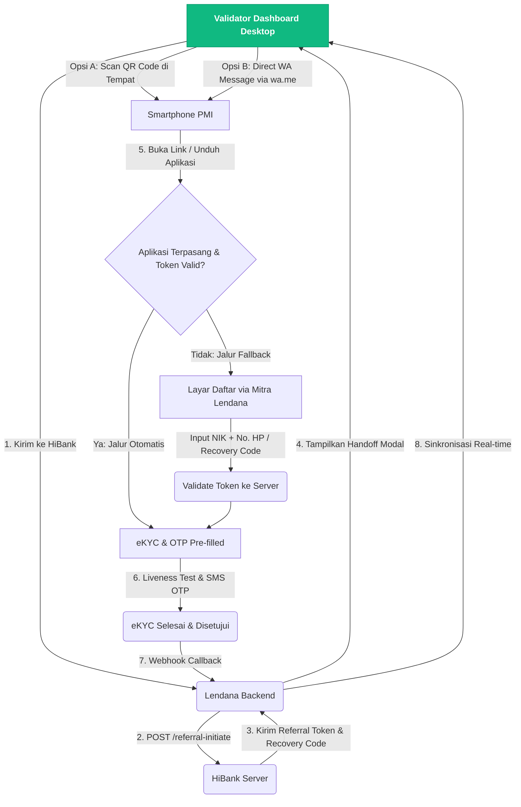
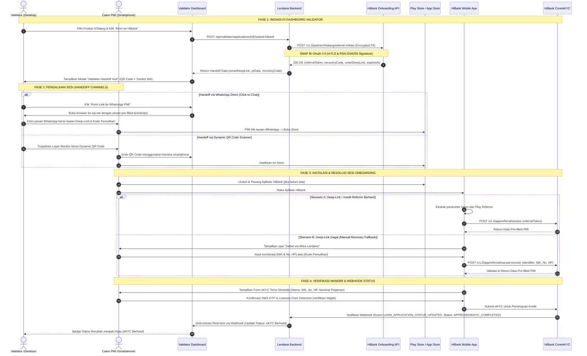

# Dokumen Alur Integrasi Lendana x HiBank (Piloting HiTalang)

Dokumen ini menjelaskan alur integrasi ujung-ke-ujung (end-to-end integration flow) antara **Lendana Financial Access Platform** dan **PT Bank Hibank Indonesia (HiBank)** untuk piloting produk **HiTalang** (dana talangan Pekerja Migran Indonesia - PMI).

Integrasi ini dirancang menggunakan standar keamanan industri perbankan (SNAP BI, enkripsi PII AES-256-GCM) serta jembatan handoff lintas perangkat (*cross-device*) yang mulus dari komputer Validator ke smartphone PMI.

---

## 1. Peta Arsitektur & Alur Bisnis (User Journey)

Proses dimulai dari verifikasi berkas oleh petugas Lendana (Validator) dan beralih ke verifikasi mandiri (eKYC & OTP) oleh PMI menggunakan smartphone pribadi:

---

## 2. Diagram Sekuens Teknis (Technical Sequence Diagram)

Interaksi teknis antar-komponen sistem (Lendana Frontend/Backend, WhatsApp, Google Play Store/App Store, Aplikasi HiBank, dan Backend HiBank) dijabarkan dalam diagram berikut:

---

## 3. Protokol Keamanan & Kriptografi Data

Integrasi ini mengikuti ketentuan ketat regulasi perbankan OJK dan Undang-Undang Perlindungan Data Pribadi (UU PDP No. 27/2022):

### 3.1 SNAP BI Standard Compliance
* **Mutual TLS (mTLS):** Enkripsi jalur komunikasi server-to-server menggunakan sertifikat TLS 1.3 bersertifikat CA resmi.
* **Autentikasi OAuth 2.0:** Menggunakan *Client Credentials* dengan metode penandatanganan payload asimetris menggunakan **RSA-SHA256 Signature**.
* **Integrasi Header:** Setiap request menyertakan header anti-replay (`X-TIMESTAMP` dan `X-EXTERNAL-ID` berupa UUIDv4).

### 3.2 Handshake Enkripsi Data Sensitif (PII Encryption)
Data identitas nasabah yang dikirimkan dari Lendana ke HiBank tidak dikirimkan dalam bentuk teks polos (*plaintext*).
* **Algoritma:** **AES-256-GCM** (kunci simetris disepakati melalui Key Management System - KMS).
* **Payload Enkripsi:** Data sensitif seperti `nik`, `fullName`, dan `mobilePhoneNumber` dibungkus di dalam parameter `encryptedPayload` pada request JSON.
* **Token Sesi (JWT):** Sesi deep-link menggunakan format JWT terenkripsi dengan algoritma **HS256** berkunci rahasia bersama, dengan masa berlaku ketat **24 Jam**.

---

## 4. Mekanisme Pemulihan & Penanganan Error (Edge Cases)

| Skenario Kasus | Masalah | Solusi & Jalur Alternatif |
| :--- | :--- | :--- |
| **Gagal Atribusi Deep-Link (OS Block / Clean Install)** | Sesi token referral hilang ketika aplikasi dibuka setelah instalasi pertama kali. | **Manual Recovery Fallback:** Nasabah diarahkan menekan menu *"Daftar via Mitra Lendana"* di layar awal HiBank, lalu memasukkan kombinasi **No. HP & NIK** atau **Kode Pemulihan** (`HTL-XXXX-XX`) untuk menarik ulang sesi dari server. |
| **Nomor WA Calon PMI Tidak Aktif / Gagal Kirim** | Pesan WhatsApp dispatcher tidak masuk ke perangkat PMI. | **QR Code Scanner:** Validator meminta PMI memindai QR Code interaktif secara langsung di layar monitor kantor cabang Lendana/P3MI. |
| **Sesi eKYC Kedaluwarsa (> 24 Jam)** | PMI baru melakukan eKYC setelah lewat dari batas waktu SLA 24 jam. | **Re-Generate Token:** Validator menekan tombol `[ ⚡ Re-Generate Link ]` di dashboard Lendana untuk memperbarui token masa berlaku 24 jam baru tanpa perlu menginput ulang data PMI. |
| **Salah Kirim WhatsApp ke Penerima Lain** | Tautan dan kode pemulihan terkirim ke nomor orang lain. | **Keamanan Biometrik & OTP:** Tautan dan data hanya dapat diselesaikan jika sesuai dengan kecocokan wajah biometrik PMI (liveness detection) dan verifikasi SMS OTP nomor HP terdaftar. |

---

## 5. Implementasi Kode pada Platform Lendana

Di dalam kode program aplikasi Lendana, flow integrasi ini didukung oleh tiga modul utama:

1. **`hibankService.ts`** ([Tautan File](file:///c:/Users/Lenovo/Documents/tempolendana3/src/lib/hibankService.ts)):
   - Bertanggung jawab memicu request referral ke API HiBank.
   - Membuat JWT token token referral (HS256) untuk simulasi deep-link.
   - Menyediakan generator teks pesan WhatsApp Click-to-Chat (`wa.me`).
2. **`HiBankHandoffModal.tsx`** ([Tautan File](file:///c:/Users/Lenovo/Documents/tempolendana3/src/components/pmi/HiBankHandoffModal.tsx)):
   - Modal pop-up antarmuka di Validator Dashboard yang menampilkan QR Code dinamis dan tombol pintasan kirim WhatsApp.
   - Menghitung waktu hitung mundur (*countdown timer*) SLA 24 jam secara real-time.
3. **`HiBankEkycSimulatorModal.tsx`** ([Tautan File](file:///c:/Users/Lenovo/Documents/tempolendana3/src/components/pmi/HiBankEkycSimulatorModal.tsx)):
   - Simulator antarmuka smartphone PMI untuk memvalidasi OTP, liveness test, dan mengirim notifikasi status eKYC (APPROVED) kembali ke dashboard Lendana.
