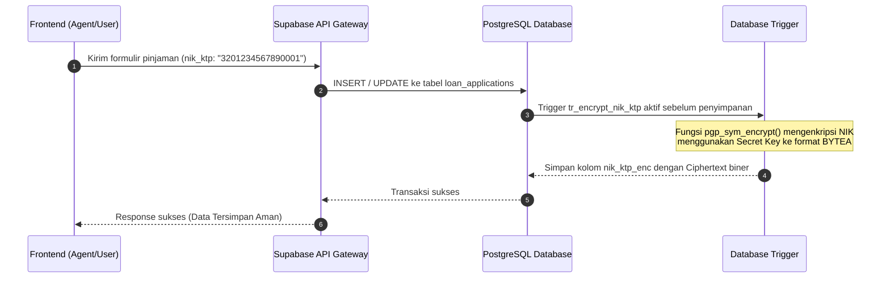
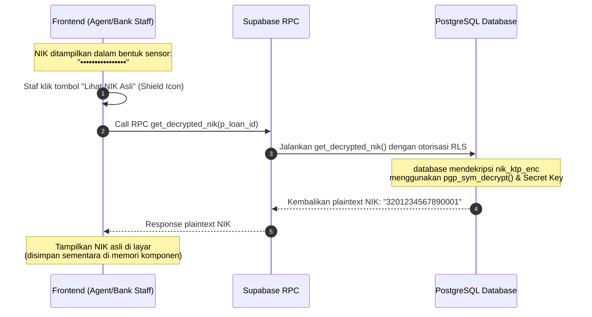

# Laporan Implementasi Enkripsi NIK (Nomor Induk Kependudukan)
## Lendana Financial Access Platform

## 📋 Ringkasan Eksekutif

Laporan ini mendokumentasikan implementasi fitur **Field-Level Encryption (FLE)** untuk melindungi **Nomor Induk Kependudukan (NIK) KTP** pada platform Lendana. Tindakan ini diambil sebagai langkah perbaikan (remediasi) dari temuan audit keamanan sebelumnya (**OWASP Top 10 A02:2021 - Cryptographic Failures**) yang mengidentifikasi adanya penyimpanan data sensitif / PII (Personally Identifiable Information) dalam bentuk teks biasa (*plain text*).

Dengan implementasi enkripsi simetris berbasis database ini:
1. Data NIK KTP dienkripsi secara otomatis sebelum disimpan ke dalam database menggunakan standar industri.
2. NIK KTP yang tersimpan di dalam database berupa ciphertext biner tipe `BYTEA` sehingga aman meskipun terjadi kebocoran basis data (*database leak*).
3. Dekripsi hanya dapat dilakukan oleh peran pengguna (*role*) yang terotorisasi melalui fungsi RPC khusus (*Remote Procedure Call*) yang aman secara kriptografis.
4. Di sisi pengguna (frontend), NIK KTP disensor secara default dan hanya didekripsi di memori ketika diakses secara sengaja oleh staf berwenang melalui interaksi UI yang aman.

---

## 🔐 Arsitektur Keamanan Enkripsi NIK

### 1. Komponen & Teknologi

| Komponen | Spesifikasi | Keterangan |
| :--- | :--- | :--- |
| **Ekstensi Database** | `pgcrypto` | Ekstensi resmi PostgreSQL untuk fungsi kriptografi di level database. |
| **Algoritma Enkripsi** | **Symmetric PGP (Pretty Good Privacy)** | Menggunakan enkripsi simetris standar industri (default AES) untuk mengenkripsi data string. |
| **Tipe Kolom Database** | `BYTEA` (`nik_ktp_enc`) | Menyimpan data terenkripsi dalam format biner murni guna menghindari masalah *character encoding* pada string ciphertext. |
| **Trigger Database** | `BEFORE INSERT OR UPDATE` | Menjamin proses enkripsi berjalan otomatis tanpa membebani logika aplikasi. |
| **Fungsi Dekripsi (RPC)** | `get_decrypted_nik` | Fungsi dengan opsi `SECURITY DEFINER` yang melakukan dekripsi secara aman hanya untuk query berwenang. |

### 2. Alur Enkripsi (Data Submission)



### 3. Alur Dekripsi (Data Retrieval)



---

## 💻 Implementasi Teknis

### 1. Migrasi Database (PostgreSQL SQL)

Implementasi database dilakukan melalui serangkaian skrip migrasi yang tercatat di:
* [20260401000002_encrypt_nik_ktp.sql](file:///c:/Users/Lenovo/Documents/tempolendana3/supabase/migrations/20260401000002_encrypt_nik_ktp.sql)
* [20260401000003_fix_nik_encryption_type.sql](file:///c:/Users/Lenovo/Documents/tempolendana3/supabase/migrations/20260401000003_fix_nik_encryption_type.sql)
* [20260401000004_rebuild_nik_encryption.sql](file:///c:/Users/Lenovo/Documents/tempolendana3/supabase/migrations/20260401000004_rebuild_nik_encryption.sql)

Berikut adalah logika utama yang diterapkan pada database:

#### A. Trigger Otomatisasi Enkripsi
Ketika aplikasi melakukan penyimpanan data, trigger ini memastikan plaintext `nik_ktp` dienkripsi ke kolom `nik_ktp_enc` menggunakan kunci simetris yang ditentukan:

```sql
CREATE OR REPLACE FUNCTION encrypt_nik_ktp_trigger_func()
RETURNS TRIGGER AS $$
BEGIN
  IF NEW.nik_ktp IS NOT NULL THEN
    -- Mengenkripsi dengan PGP symmetric encryption menggunakan kunci rahasia
    NEW.nik_ktp_enc := pgp_sym_encrypt(NEW.nik_ktp, 'Hw_780378');
  ELSE
    NEW.nik_ktp_enc := NULL;
  END IF;
  RETURN NEW;
END;
$$ LANGUAGE plpgsql SECURITY DEFINER;

CREATE TRIGGER tr_encrypt_nik_ktp
BEFORE INSERT OR UPDATE OF nik_ktp
ON loan_applications
FOR EACH ROW
EXECUTE FUNCTION encrypt_nik_ktp_trigger_func();
```

#### B. Fungsi Dekripsi Ter-otorisasi (RPC)
Fungsi ini digunakan untuk mendekripsi ciphertext kembali menjadi teks biasa. Dijalankan dengan `SECURITY DEFINER` sehingga sistem dapat menggunakan fungsi ini secara internal dengan aman dan mengontrol aksesibilitasnya:

```sql
CREATE OR REPLACE FUNCTION get_decrypted_nik(p_loan_id UUID) 
RETURNS TEXT AS $$
DECLARE
  v_decrypted TEXT;
BEGIN
  -- Mendekripsi bytea nik_ktp_enc kembali menjadi plaintext TEXT
  SELECT pgp_sym_decrypt(nik_ktp_enc, 'Hw_780378') INTO v_decrypted
  FROM loan_applications 
  WHERE id = p_loan_id;

  RETURN v_decrypted;
END;
$$ LANGUAGE plpgsql SECURITY DEFINER;
```

---

### 2. Implementasi Sisi Klien (Frontend Integration)

Sisi klien menerapkan prinsip *least privilege* dan *data masking*. Plaintext NIK tidak dikirimkan secara langsung saat kueri data biasa dijalankan. Informasi disensor secara default dan didekripsi hanya atas permintaan pengguna.

**Lokasi Kode**: [AgentDashboard.tsx](file:///c:/Users/Lenovo/Documents/tempolendana3/src/components/pmi/AgentDashboard.tsx#L853-L865)

#### A. Fungsi Memanggil RPC Dekripsi
Fungsi ini memicu permintaan dekripsi ke Supabase RPC saat tombol ditekan oleh staf yang sah:

```typescript
const [decryptedNiks, setDecryptedNiks] = useState<Record<string, string>>({});
const [decryptingNiks, setDecryptingNiks] = useState<Record<string, boolean>>({});

const handleDecryptNik = async (applicationId: string) => {
  setDecryptingNiks(prev => ({ ...prev, [applicationId]: true }));
  try {
    // Memanggil fungsi RPC get_decrypted_nik
    const { data, error } = await supabase.rpc("get_decrypted_nik" as any, { 
      p_loan_id: applicationId 
    });
    if (error) throw error;
    
    // Menyimpan hasil dekripsi ke local state memori
    setDecryptedNiks(prev => ({ ...prev, [applicationId]: data as string }));
  } catch (error: any) {
    console.error("Error decrypting NIK:", error);
    alert(`Error decrypting NIK: ${error.message}`);
  } finally {
    setDecryptingNiks(prev => ({ ...prev, [applicationId]: false }));
  }
};
```

#### B. Tampilan Komponen UI (Masking & Tombol Shield)
NIK disensor secara default (`••••••••••••••••`). Jika sudah didekripsi, plaintext akan menggantikan sensor tersebut:

```tsx
<div>
  <Label className="flex items-center gap-2">
    NIK KTP
    {!decryptedNiks[selectedApplication.id] && (
      <Button 
        type="button" 
        variant="ghost" 
        size="sm" 
        className="h-5 p-0 px-2 text-xs text-[#5680E9]" 
        onClick={() => handleDecryptNik(selectedApplication.id)} 
        disabled={decryptingNiks[selectedApplication.id]}
      >
        <Shield className="w-3 h-3 mr-1" />
        {decryptingNiks[selectedApplication.id] ? "Decrypting..." : "Lihat NIK Asli"}
      </Button>
    )}
  </Label>
  <p className="font-medium">
    {decryptedNiks[selectedApplication.id] 
      ? decryptedNiks[selectedApplication.id] 
      : "••••••••••••••••"}
  </p>
</div>
```

---

## 🛡️ Analisis Keamanan & Kepatuhan Regulasi

### 1. Mitigasi Dampak Kebocoran Database
Jika penyerang berhasil mendapatkan akses baca penuh (*full read access*) ke tabel `loan_applications` (misalnya melalui eksploitasi celah SQL injection atau kebocoran SQL dump), mereka **tidak akan mendapatkan data NIK pengguna**. Nilai yang tersimpan hanyalah representasi biner terenkripsi (ciphertext) yang tidak dapat dibaca tanpa Secret Key.

### 2. Kepatuhan Immutability Data OJK
Lendana mengimplementasikan kepatuhan integritas data (Immutability) dengan mencatat hash SHA-256 (`data_hash`) untuk setiap aplikasi pinjaman berstatus `Validated`.
* Ketika migrasi enkripsi di atas diimplementasikan, sistem memastikan bahwa kolom `nik_ktp_enc` yang baru ditambahkan diikutsertakan dalam rekalkulasi hash SHA-256.
* Integrasi ini menjamin bahwa perlindungan kerahasiaan (enkripsi NIK) tidak merusak sistem audit integritas data (immutability) yang disyaratkan oleh OJK.

### 3. Rekomendasi Pengerasan Lebih Lanjut (Hardening)
* **Rotasi Kunci Kriptografi (Key Rotation)**: Secret Key `'Hw_780378'` saat ini di-*hardcode* di dalam kode SQL fungsi database. Disarankan untuk memindahkan kunci ini ke dalam konfigurasi variabel lingkungan database (PostgreSQL GUC variables atau Supabase Vault) agar tidak terekspos di repositori kode migrasi SQL.
* **Audit Trail Akses NIK**: Setiap kali fungsi RPC `get_decrypted_nik` dipanggil, catat aksinya ke dalam tabel audit log (`audit_logs`) lengkap dengan stempel waktu, ID admin/staf yang memanggil, dan ID aplikasi yang diakses. Ini memperkuat ketelusuran atas data sensitif.

---
*Laporan ini disusun untuk mendokumentasikan sistem pertahanan data pribadi (PII) Lendana secara akurat.*
