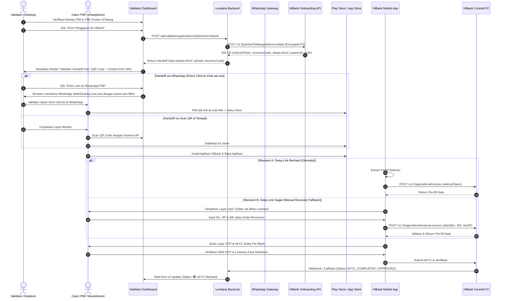
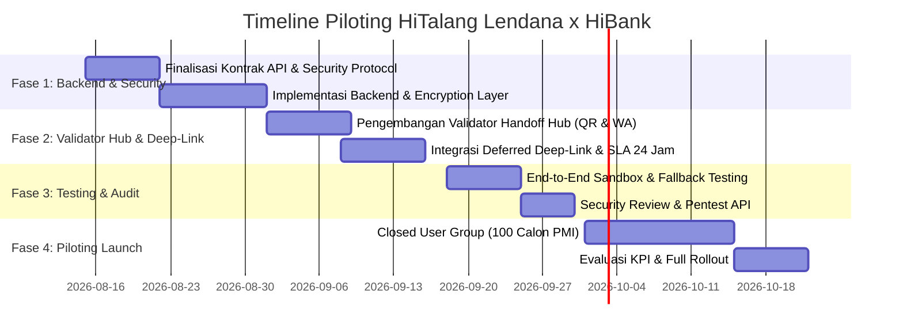

# Product Requirements Document (PRD)
# Integrasi API Digital Banking: HiBank (Produk HiTalang)

---

## Informasi Dokumen

| Parameter | Keterangan |
| :--- | :--- |
| **Judul Produk** | Integrasi API Digital Banking Lendana x HiBank (Piloting HiTalang) |
| **Nomor Dokumen** | PRD-LDN-HIBANK-2026-01 |
| **Versi** | 1.2 (Integrated: Validator Handoff Hub, QR Code, WA Dispatcher, Manual Recovery, & 24h SLA) |
| **Status** | Approved for Development |
| **Target Rilis Piloting** | Q3 2026 |
| **Product Owner** | Lendana Product Team |
| **Tech Lead / Architect** | Lendana Engineering & Security Team |
| **Partner Eksternal** | PT Bank Hibank Indonesia (HiBank) |
| **Klasifikasi Keamanan** | Rahasia / Internal & Partner |

---

## 1. Executive Summary

Dokumen ini mendefinisikan persyaratan fungsional, teknis, dan operasional untuk integrasi API antara **Lendana Financial Access Platform** dan **HiBank** untuk program *piloting* produk pinjaman **HiTalang** (pembiayaan/dana talangan penempatan Pekerja Migran Indonesia - PMI).

Dalam alur operasional Lendana, pengajuan pinjaman diverifikasi dan diproses oleh **Validator** melalui **Validator Dashboard** (pada perangkat Desktop/Laptop). Integrasi ini menghadirkan fitur **Validator Handoff Hub** yang menjembatani pengalihan pengajuan dari komputer Validator ke smartphone calon PMI melalui:
1. **Dynamic QR Code Scanner** (untuk pemindaian langsung di kantor/P3MI).
2. **WhatsApp Direct Dispatcher** (pengiriman tautan instan ke nomor WhatsApp calon PMI).
3. **Smart Deferred Deep-Link (Masa Berlaku 24 Jam)** menuju Store / Aplikasi HiBank.
4. **Manual Recovery Fallback** (pencocokan kombinasi NIK & No. HP atau Recovery Code jika *attribution referrer* gagal).

Ketika calon PMI membuka aplikasi HiBank, data pribadi (Nama, NIK, No. HP, dan Rincian Pinjaman) langsung terisi secara otomatis (*pre-filled*) pada halaman **eKYC & OTP**, sehingga PMI hanya perlu melakukan verifikasi wajah (*liveness detection*) dan konfirmasi SMS OTP.

---

## 2. Latar Belakang & Nilai Bisnis (Business Value)

### 2.1 Latar Belakang
- **Alur Operasional Berbasis Validator:** Data calon PMI, legalitas dokumen P3MI, dan kelayakan awal diverifikasi secara terpusat oleh Validator di kantor cabang/agensi menggunakan **Validator Dashboard**.
- **Kebutuhan eKYC Mandiri:** Regulasi perbankan OJK dan standar verifikasi identitas mewajibkan verifikasi biometrik (*liveness face test*) dan tanda tangan digital/OTP dilakukan langsung oleh calon PMI pada smartphone pribadinya.
- **Tantangan Cross-Device (Desktop $\to$ Smartphone):** Diperlukan jembatan handoff yang mulus dari komputer Validator ke smartphone PMI tanpa membebani PMI untuk mengetik tautan atau menginput ulang berkas.
- **SLA Waktu & Konektivitas:** Mengingat kondisi lapangan, masa berlaku tautan dan sesi pengajuan ditetapkan selama **24 jam**.

### 2.2 Nilai Bisnis
1. **Seamless Cross-Device Handoff:** Validator dapat mentransfer sesi pengajuan ke HP nasabah secara instan melalui QR Code di layar atau pesan WhatsApp otomatis.
2. **Zero Data Re-Entry (Zero Friction):** Calon PMI tidak perlu mengulang pengisian formulir di aplikasi bank.
3. **Dual-Path Onboarding (Deep-Link + Manual Fallback):** Menjamin tingkat keberhasilan onboarding mencapai $\ge 99\%$, bahkan jika install referrer di perangkat terblokir.
4. **Efisiensi Kerja Validator:** Validator memiliki dashboard terpusat untuk memantau progres eKYC nasabah, mengirim ulang link (*resend link*), dan memantau status pencairan secara *real-time*.
5. **Secure & Compliant Handshake:** Data sensitif terlindungi dengan standar keamanan perbankan (SNAP BI, AES-256, RSA Token, dan UU PDP No. 27/2022).

---

## 3. Tujuan Produk & Success Metrics (KPIs)

### 3.1 Tujuan Produk
- Menyediakan modul **Validator Handoff Hub** pada Validator Dashboard Lendana.
- Mengintegrasikan API HiBank untuk menghasilkan Smart Deep-Link, QR Code, dan Kode Pemulihan.
- Memastikan transisi *seamless* ke aplikasi HiBank dengan halaman eKYC & OTP yang telah terisi (*pre-filled*).
- Menyediakan pelacakan status (*live status sync*) dua arah melalui Webhook.

### 3.2 Key Performance Indicators (KPIs)

| Kategori KPI | Target Metric |
| :--- | :--- |
| **Funnel Conversion Rate** | $\ge 85\%$ pengajuan yang di-submit Validator menyelesaikan eKYC di HiBank |
| **Handoff Success Rate** | $\ge 95\%$ PMI berhasil mengakses sesi via QR Code atau WhatsApp Link |
| **Time to Complete eKYC** | $\le 3$ menit sejak PMI membuka aplikasi HiBank |
| **API Latency (Initiate/Recover)** | $\le 1.2$ detik (P95) |
| **Token Validity Window** | 24 Jam (SLA Expiry Time) |
| **Validator Efficiency** | Peningkatan kecepatan proses verifikasi pinjaman sebesar 50% |

---

## 4. Target Pengguna (User Persona)

1. **Validator / Petugas P3MI (Operator Dashboard):**
   - Mengoperasikan komputer desktop/laptop di kantor.
   - Bertanggung jawab memvalidasi dokumen fisik/digital, memilih produk HiTalang, dan menginisiasi proses handoff ke nasabah.
2. **Calon Pekerja Migran Indonesia (CPMI / PMI):**
   - Pengguna smartphone Android/iOS.
   - Melakukan scan QR / klik link WA, mengunduh HiBank, dan menyelesaikan verifikasi wajah & OTP.
3. **Sistem HiBank Underwriting & Core Banking:**
   - Memproses data nasabah baru (Customer Onboarding) dan melakukan scoring kredit eKYC secara instan.

---

## 5. End-to-End User Flow & Arsitektur

### 5.1 Alur Pengguna (User Journey)

```
[1. Validator Dashboard (Desktop)]
  Validator memeriksa kelengkapan berkas PMI -> Memilih "HiTalang by HiBank"
  -> Klik Tombol: ["Kirim Pengajuan ke HiBank"]
             │
             ▼
[2. Lendana Backend & HiBank API]
  Backend validasi data -> Hit API HiBank -> Menerima:
  - Smart Deep-Link
  - Recovery Code (misal: HTL-8921-X9)
  - Masa Berlaku: 24 Jam
             │
             ▼
[3. Validator Handoff Hub (Modal di Dashboard)]
  Muncul Modal Handoff di layar Validator dengan 3 Opsi:
  ├─► Opsi A: Tampilkan Dynamic QR Code -> Calon PMI langsung scan menggunakan kamera HP.
  ├─► Opsi B: Tombol "Kirim Link ke WhatsApp PMI" -> Sistem kirim WA otomatis ke HP PMI.
  └─► Opsi C: Tombol "Salin Link & Kode Pemulihan" -> Untuk pengiriman manual.
             │
             ▼
[4. Smartphone Calon PMI]
  PMI membuka link via Scan QR / Chat WhatsApp -> Dialihkan ke Play Store / App Store
  -> PMI mengunduh & memasang aplikasi HiBank
             │
             ▼
  ┌─────────────────────────────────────────────────────────────┐
  │ Apakah Deep-Link / Install Referrer Berhasil Dikenali?       │
  └──────────────────────────────┬──────────────────────────────┘
                                 │
                 ┌───────────────┴───────────────┐
                 ▼ [YA - Jalur Otomatis]         ▼ [TIDAK - Jalur Fallback]
     [5A. Auto Deep-Link Resolver]     [5B. Layar Selamat Datang HiBank]
       Aplikasi HiBank membaca token     Pengguna klik: "Punya Kode Referral /
                                         Daftar via Mitra Lendana?"
                                                 │
                                                 ▼
                                       [Input NIK & No. HP atau Recovery Code]
                                                 │
                                                 ▼
                                       [Validasi Token ke Server HiBank]
                 │                               │
                 └───────────────┬───────────────┘
                                 ▼
                   [6. Halaman eKYC & OTP Terbuka]
     Data terisi otomatis (Pre-filled):
     - Nama Lengkap (sesuai KTP)
     - NIK & No. Handphone
     - Plafon Pinjaman & Tenor HiTalang
                                 │
                                 ▼
                   [7. Verifikasi Wajah & OTP oleh PMI]
     PMI terima SMS OTP -> Liveness Test -> Approval -> Webhook update ke Validator Dashboard
```

### 5.2 Sequence Diagram (Technical Sequence)



---

## 6. Spesifikasi Kebutuhan Fungsional (Functional Requirements)

### 6.1 Modul Validator Dashboard (Frontend & Backend Lendana)

| ID | Kebutuhan Fungsional | Deskripsi | Prioritas |
| :--- | :--- | :--- | :--- |
| **FR-VAL-01** | Tombol CTA Submit HiTalang | Pada halaman detail pengajuan di Validator Dashboard, terdapat tombol aksi: `[ 🏦 Kirim ke HiBank (HiTalang) ]`. | P0 (Must Have) |
| **FR-VAL-02** | Validator Handoff Modal | Menampilkan dialog pop-up interaktif berisi Dynamic QR Code, tombol pengiriman WhatsApp, dan rincian Kode Pemulihan. | P0 (Must Have) |
| **FR-VAL-03** | Dynamic QR Code Generator | Menghasilkan SVG/Canvas QR Code yang mengarah langsung ke tautan Smart Deep-Link. | P0 (Must Have) |
| **FR-VAL-04** | WhatsApp Dispatcher (`wa.me` Direct) | Tombol `[ 📲 Kirim Link ke WhatsApp ]` yang membuka WhatsApp Web/Desktop dengan nomor HP dan pesan terformat otomatis (*Click-to-Chat* via `wa.me`, tanpa dependensi gateway eksternal). | P0 (Must Have) |
| **FR-VAL-05** | Real-time Status Tracker & Timer | Tabel pengajuan di dashboard menampilkan badge status: `🟡 Menunggu eKYC HiBank` disertai sisa waktu mundur (*countdown* SLA 24 jam). | P0 (Must Have) |
| **FR-VAL-06** | Aksi Resend & Refresh Status | Validator dapat menekan tombol `[ 🔄 Refresh Status ]` untuk memeriksa status eKYC terbaru atau `[ 📲 Kirim Ulang Link ]` jika nasabah belum membukanya. | P1 (Should Have) |

### 6.2 Modul Smart Deep-Linking & SLA 24 Jam

| ID | Kebutuhan Fungsional | Deskripsi | Prioritas |
| :--- | :--- | :--- | :--- |
| **FR-LNK-01** | Routing Adaptif Platform | Tautan secara cerdas mendeteksi OS (Android/iOS) dan ketersediaan aplikasi HiBank di perangkat PMI. | P0 (Must Have) |
| **FR-LNK-02** | Deferred Deep Link Retention | Jika aplikasi belum terpasang, tautan membawa ke Play Store/App Store dan menyimpan parameter `referral_token` via *Google Play Install Referrer API*. | P0 (Must Have) |
| **FR-LNK-03** | SLA Masa Berlaku 24 Jam | Deep-link token dan sesi pengajuan tersimpan aktif selama **24 jam** (`expiresAt = T + 24 Jam`). | P0 (Must Have) |

### 6.3 Modul HiBank Onboarding & Fallback Recovery (HiBank Side)

| ID | Kebutuhan Fungsional | Deskripsi | Prioritas |
| :--- | :--- | :--- | :--- |
| **FR-HBK-01** | Token Resolver on App Launch | Aplikasi HiBank saat *cold launch* membaca payload referral dan memvalidasi token ke server HiBank. | P0 (Must Have) |
| **FR-HBK-02** | Manual Recovery Entry Point | Pada halaman awal aplikasi HiBank, disediakan tombol alternatif: *"Lanjutkan Pengajuan dari Mitra Lendana"* jika deep-link tidak otomatis aktif. | P0 (Must Have) |
| **FR-HBK-03** | Verifikasi Fallback NIK & No. HP | Pengguna dapat memasukkan **No. Handphone & NIK** (atau **Kode Pemulihan**) untuk mengambil sesi pengajuan yang tertunda dalam kurun 24 jam. | P0 (Must Have) |
| **FR-HBK-04** | Pre-filled Form Fields | Setelah sesi teridentifikasi (baik via link atau manual recovery), data berikut terisi otomatis (*read-only*):<br>- Nama Lengkap (sesuai e-KTP)<br>- NIK (Nomor Induk Kependudukan)<br>- Nomor Handphone (untuk OTP)<br>- Jumlah Pinjaman & Tenor yang Dipilih | P0 (Must Have) |
| **FR-HBK-05** | Fast-track OTP & Biometrik | Pengguna hanya perlu menerima SMS OTP dan melakukan *Liveness Face Verification* tanpa mengunggah ulang data identitas dasar. | P0 (Must Have) |

---

## 7. Spesifikasi Teknis & Integrasi API

### 7.1 Standar Keamanan & Autentikasi API
Integrasi menggunakan standar **SNAP BI (Standar Nasional Open API Pembayaran)** dan keamanan perbankan OJK:
- **Transport Security:** TLS 1.3 / HTTPS dengan mTLS (Mutual TLS) untuk komunikasi Server-to-Server.
- **Autentikasi:** OAuth 2.0 Client Credentials dengan Asymmetric Key Signature (RSA-SHA256).
- **Enkripsi Data Sensitif (PII):** Payload data pribadi (NIK, No HP, Nama) dienkripsi menggunakan **AES-256-GCM** sebelum ditransmisikan.
- **Timestamp & Nonce:** Pencegahan *replay attack* dengan header `X-TIMESTAMP` (ISO 8601) dan `X-EXTERNAL-ID` (UUID v4 unik).

---

### 7.2 Spesifikasi Kontrak API (API Contract)

#### 1. Initiate HiTalang Referral (Lendana Backend ➔ HiBank)
- **Method:** `POST`
- **Path:** `/api/v1.0/partner/hitalang/referral-initiate`
- **Headers:**
  ```http
  Authorization: Bearer <ACCESS_TOKEN>
  X-TIMESTAMP: 2026-08-11T12:00:00+07:00
  X-SIGNATURE: <RSA_SHA256_SIGNATURE>
  X-PARTNER-ID: LENDANA-PROD
  X-EXTERNAL-ID: f47ac10b-58cc-4372-a567-0e02b2c3d479
  Content-Type: application/json
  ```
- **Request Body (JSON):**
  ```json
  {
    "partnerReferenceNo": "LDN-PMI-20260811-00089",
    "validatorId": "VAL-JKT-042",
    "encryptedPayload": "eyJlbmMiOiJBMjU2R0NNIiwiYWxnIjoiUlNBLU9BRVAtMjU2In0...",
    "referralData": {
      "productCode": "HITALANG_PMI",
      "loanDetails": {
        "requestedAmount": 25000000,
        "tenorMonths": 12,
        "purpose": "BIAYA_PENEMPATAN_PMI",
        "countryDestination": "TAIWAN",
        "p3miPartnerCode": "P3MI-TASPEN-001"
      },
      "customerSummary": {
        "nik": "3201234567890001",
        "fullName": "SITI NURHALIZA",
        "mobilePhoneNumber": "+6281234567890",
        "email": "siti.nurhaliza@example.com",
        "pmiIdNumber": "PMI-2026-JKT-99812"
      },
      "redirectUrls": {
        "callbackUrl": "https://api.lendana.id/webhooks/hibank/callback",
        "fallbackStoreUrl": "https://play.google.com/store/apps/details?id=id.co.hibank.digital"
      }
    }
  }
  ```

- **Response Body (200 OK) - SLA Expiry 24 Jam & Recovery Code:**
  ```json
  {
    "responseCode": "2002500",
    "responseMessage": "Successful",
    "partnerReferenceNo": "LDN-PMI-20260811-00089",
    "hibankReferenceNo": "HBK-REF-99281726",
    "referralToken": "rft_eyJhbGciOiJIUzI1NiIsInR5cCI6IkpXVCJ9...",
    "recoveryCode": "HTL-8921-X9",
    "smartDeepLink": "https://hibank.id/dl/hitalang?token=rft_eyJhbGciOiJIUzI1NiIsInR5cCI6IkpXVCJ9&utm_source=lendana&utm_campaign=hitalang_piloting",
    "createdAt": "2026-08-11T12:00:00+07:00",
    "expiresAt": "2026-08-12T12:00:00+07:00"
  }
  ```

---

#### 2. Manual Recovery Fallback API (HiBank Mobile ➔ HiBank Server)
*Endpoint ini digunakan saat Deep-Link / Install Referrer gagal di perangkat pengguna.*
- **Method:** `POST`
- **Path:** `/api/v1.0/app/referral/manual-recover`
- **Request Body (JSON):**
  ```json
  {
    "recoveryMethod": "PHONE_AND_NIK", 
    "mobilePhoneNumber": "+6281234567890",
    "nik": "3201234567890001",
    "recoveryCode": "HTL-8921-X9",
    "deviceId": "and-99a8b7c6d5e4f3"
  }
  ```
- **Response Body (200 OK):**
  ```json
  {
    "responseCode": "2002500",
    "status": "SESSION_RESTORED",
    "nextScreen": "EKYC_OTP_VERIFICATION",
    "prefilledData": {
      "partnerReferenceNo": "LDN-PMI-20260811-00089",
      "fullName": "SITI NURHALIZA",
      "nik": "3201234567890001",
      "mobilePhoneNumber": "+6281234567890",
      "loanAmount": 25000000,
      "tenorMonths": 12,
      "productName": "HiTalang PMI - Taiwan"
    }
  }
  ```

---

#### 3. Status Webhook Notification (HiBank Server ➔ Lendana)
- **Method:** `POST`
- **Path:** `/webhooks/hibank/callback`
- **Payload (JSON):**
  ```json
  {
    "event": "LOAN_APPLICATION_STATUS_UPDATED",
    "partnerReferenceNo": "LDN-PMI-20260811-00089",
    "hibankReferenceNo": "HBK-REF-99281726",
    "applicationStatus": "APPROVED", 
    "recoveryMethodUsed": "DEEP_LINK_AUTO",
    "statusDetail": "eKYC Verified and Credit Limit Approved",
    "approvedAmount": 25000000,
    "interestRatePerMonth": 0.006,
    "disbursementStatus": "READY_FOR_DISBURSEMENT",
    "timestamp": "2026-08-11T12:44:58+07:00"
  }
  ```

---

## 8. Desain Antarmuka & UX (Validator Dashboard UI/UX)

### 8.1 Wireframe Modal "Validator Handoff Hub"
Ketika Validator menekan tombol `[ 🏦 Kirim ke HiBank ]` pada `ValidatorDashboard.tsx`, dialog modal ini muncul:

```
┌─────────────────────────────────────────────────────────────────────────────┐
│  🏦 Handoff Pengajuan HiTalang ke HiBank                                   │
│  Calon PMI: Siti Nurhaliza | NIK: 320123******0001                          │
├─────────────────────────────────────────────────────────────────────────────┤
│                                                                             │
│     ┌──────────────┐   PILIHAN CARA HANDOFF KE SMARTPHONE PMI:              │
│     │  ████  ████  │                                                        │
│     │  █  █  █  █  │   1. SCAN QR CODE DI TEMPAT                            │
│     │  ████  ████  │   Minta calon PMI scan QR Code di samping menggunakan  │
│     │  █  █  █  █  │   kamera HP untuk langsung unduh/buka HiBank.          │
│     │  ████  ████  │                                                        │
│     └──────────────┘   2. KIRIM LINK VIA WHATSAPP (Sangat Disarankan)       │
│                        [ 📲 Kirim Tautan eKYC ke WhatsApp PMI ]              │
│      Scan QR Code                                                           │
│                        3. SALIN KODE RECOVERY MANUAL                        │
│                        Kode: [ HTL-8921-X9 ]  [ 📋 Salin Kode & Link ]      │
│                                                                             │
│  ⏱️ Masa berlaku sesi pengajuan: 24 Jam (Berakhir: 12 Agt 2026, 12:00 WIB)  │
├─────────────────────────────────────────────────────────────────────────────┤
│  [ Tutup ]                                      [ 🔄 Refresh Status eKYC ]  │
└─────────────────────────────────────────────────────────────────────────────┘
```

### 8.2 Tampilan Tabel Status Pengajuan pada Validator Dashboard

| ID Aplikasi | Nama Calon PMI | Produk | Status HiBank | Sisa Waktu SLA | Aksi Validator |
| :--- | :--- | :--- | :--- | :--- | :--- |
| **LDN-00089** | Siti Nurhaliza | HiTalang | `🟡 Menunggu eKYC` | 23 Jam 40 Mnt | `[ 📲 Kirim Ulang WA ]` `[ 🔄 Cek Status ]` |
| **LDN-00088** | Ahmad Fauzi | HiTalang | `🟢 eKYC Berhasil` | - | `[ 👁️ Lihat Detail ]` |
| **LDN-00085** | Budi Santoso | HiTalang | `🔴 Sesi Expired` | 00 Jam 00 Mnt | `[ ⚡ Re-Generate Link ]` |

### 8.3 Template Pesan Otomatis WhatsApp ke PMI
```text
Halo SITI NURHALIZA,

Pengajuan fasilitas pembiayaan HiTalang Anda sebesar Rp 25.000.000 telah diverifikasi oleh tim Lendana dan siap diproses di HiBank.

Langkah Terakhir: Selesaikan verifikasi wajah (eKYC) dan konfirmasi OTP melalui aplikasi resmi HiBank.

👉 Klik tautan berikut untuk melanjutkan:
https://hibank.id/dl/hitalang?token=rft_eyJhbGciOiJIUzI1Ni...

ℹ️ Jika aplikasi tidak otomatis memuat data Anda, gunakan:
- Nomor HP: 081234567890
- NIK: 3201234567890001
- Kode Pemulihan: HTL-8921-X9

⏱️ Tautan ini berlaku selama 24 Jam.
Salam,
Tim Lendana & HiBank
```

> **Catatan Teknis Implementasi (Piloting):**
> Untuk tahap piloting, tombol *Kirim ke WhatsApp* menggunakan protokol **Direct Click-to-Chat (`https://wa.me/{phone}?text={encodedText}`)**. Browser Validator akan langsung membuka WhatsApp Web/Desktop dengan nomor dan pesan di atas yang sudah terisi otomatis tanpa memerlukan setup gateway API pihak ketiga maupun biaya langganan tambahan.

---

## 9. Kepatuhan Regulasi, Keamanan Data & Privasi

### 9.1 Kepatuhan UU Perlindungan Data Pribadi (UU PDP No. 27/2022)
- **Explicit Consent:** Sebelum Validator menekan tombol kirim, sistem memastikan checkbox persetujuan PMI telah tercentang dalam dokumen fisik/digital aplikasi.
- **Enkripsi Transit & Rest:** Seluruh parameter PII dienkripsi dengan AES-256-GCM.
- **Otentikasi OTP:** Pengaksesan data form eKYC pada jalur manual recovery tetap diproteksi SMS OTP sebelum data lengkap dibuka di layar nasabah.

### 9.2 Audit Log Akses Validator
- Sistem mencatat log audit: ID Validator, IP Address, Timestamp, dan aksi pengiriman link (*audit trail compliance* OJK POJK No. 11/2022).

---

## 10. Penanganan Error & Edge Cases (Edge Cases & Fallbacks)

| Skenario Kasus | Resiko / Permasalahan | Solusi & Mekanisme Fallback |
| :--- | :--- | :--- |
| **Deep-Link Referrer Gagal (OS Block)** | Token tidak terbaca saat aplikasi HiBank dibuka pertama kali. | **Manual Recovery:** PMI memasukkan No. HP & NIK / Kode Recovery pada menu *"Daftar via Mitra Lendana"* di aplikasi HiBank. |
| **Nomor WhatsApp PMI Tidak Aktif** | Pesan WhatsApp gagal terkirim (*undelivered*). | Validator langsung menampilkan **QR Code** di layar monitor untuk di-scan kamera smartphone PMI di tempat. |
| **Sesi Kedaluwarsa (> 24 Jam)** | PMI baru membuka aplikasi setelah lebih dari 24 jam. | Validator menekan tombol `[ ⚡ Re-Generate Link ]` di Validator Dashboard untuk membuat token 24 jam baru tanpa mengisi ulang berkas. |
| **Salah Input Nomor Telepon oleh Validator** | Link terkirim ke orang yang salah. | Token terenkripsi dengan NIK spesifik PMI dan dilindungi verifikasi wajah & OTP, sehingga tidak dapat disalahgunakan pihak ketiga. |

---

## 11. Rencana Rilis & Timeline Piloting (Milestones)



---

## 12. Matriks Tanggung Jawab (RACI Matrix)

| Aktivitas | Validator / P3MI | Lendana Core | HiBank |
| :--- | :---: | :---: | :---: |
| Verifikasi Kelayakan Berkas PMI di Kantor | **A / R** | I | I |
| Trigger Handoff (QR Code / WhatsApp Dispatch) | **A / R** | C | I |
| Penyediaan Smart Deep-Link & Referral Token | I | C | **A / R** |
| Verifikasi Biometrik (eKYC) & OTP oleh PMI | I | I | **A / R** |
| Notifikasi Webhook Status eKYC & Persetujuan | I | C | **A / R** |
| Monitoring Dashboard & Re-send Action | **A / R** | I | I |

*Keterangan: **R** = Responsible, **A** = Accountable, **C** = Consulted, **I** = Informed.*

---

## 13. Persetujuan & Dokumen Terkait

Dokumen ini membutuhkan persetujuan resmi dari seluruh pemangku kepentingan sebelum implementasi teknis dimulai.

| Nama Stakeholder | Jabatan | Tanda Tangan | Tanggal |
| :--- | :--- | :--- | :--- |
| **Head of Product** | Lendana | ____________________ | ___/___/2026 |
| **Chief Technology Officer** | Lendana | ____________________ | ___/___/2026 |
| **Product Lead Digital Banking** | PT Bank Hibank Indonesia | ____________________ | ___/___/2026 |
| **Head of IT Security & Compliance**| PT Bank Hibank Indonesia | ____________________ | ___/___/2026 |

---
*Dokumen ini disusun oleh Tim Produk & Engineering PT Lendana Digitalindo Nusantara.*
