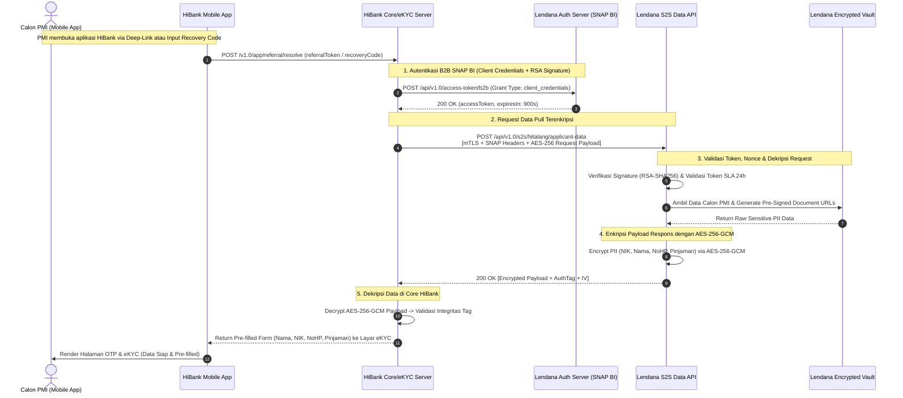
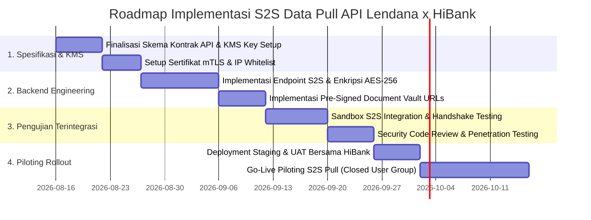

# Product Requirements Document (PRD)
# Layanan API Server-to-Server (S2S) Secure Data Pull: Lendana x HiBank
## Pengambilan Data Sensitif Calon PMI Terenkripsi AES-256 (Produk HiTalang)

---

## Informasi Dokumen

| Parameter | Keterangan |
| :--- | :--- |
| **Judul Produk** | S2S Secure Data Pull API (Lendana ➔ HiBank) - HiTalang Integration |
| **Nomor Dokumen** | PRD-LDN-HIBANK-2026-02 |
| **Versi** | 1.0 |
| **Status** | Approved for Development |
| **Target Implementasi** | Q3 2026 |
| **Product Owner** | Lendana Security & Core Backend Team |
| **Tech Lead / Security Architect** | Lendana Engineering & Lead InfoSec |
| **Partner Eksternal** | PT Bank Hibank Indonesia (HiBank Core Banking & eKYC Team) |
| **Klasifikasi Dokumen** | Rahasia / Confidential (Internal & Partner Only) |

---

## 1. Executive Summary

Dokumen ini mendefinisikan arsitektur teknis, protokol kriptografi, dan spesifikasi API **Server-to-Server (S2S) Secure Data Pull** antara **Lendana Financial Access Platform** dan **PT Bank Hibank Indonesia (HiBank)**.

Layanan ini memungkinkan server backend HiBank untuk menarik (*pull*) data sensitif calon PMI (*Personally Identifiable Information* - PII: NIK, Nama Lengkap, No. Handphone, Detail Pinjaman, dan Dokumen Persyaratan) secara langsung dari server Lendana. Komunikasi dilakukan melalui jalur tertutup antar data center menggunakan **Mutual TLS (mTLS)**, autentikasi **SNAP BI OAuth 2.0**, tanda tangan digital **RSA-SHA256**, dan enkripsi muatan data end-to-end berbasis **AES-256-GCM**.

Dengan mekanisme ini, **tidak ada data sensitif / PII yang terekspos dalam tautan URL deep-link, parameter aplikasi mobile, maupun browser sisi klien**. Seluruh pertukaran data identitas nasabah terjadi secara aman di tingkat backend bank (*bank-grade server-to-server confidentiality*).

---

## 2. Latar Belakang & Nilai Keamanan (Security Rationale)

### 2.1 Latar Belakang & Kebutuhan
1. **Pencegahan Kebocoran Data Sisi Klien:** Pada skenario *deferred deep-linking*, pengiriman data identitas nasabah secara langsung di dalam payload URL atau penyimpanan lokal perangkat (*local storage/intent*) berisiko disadap oleh aplikasi berbahaya atau log sistem OS.
2. **Kepatuhan UU Pelindungan Data Pribadi (UU PDP No. 27/2022):** Pemrosesan dan transfer data identitas spesifik (NIK, biometrik, data keuangan) mewajibkan enkripsi tingkat tinggi (*Data in Transit & Data at Rest*) serta prinsip kerahasiaan (*confidentiality*).
3. **Standar Nasional Open API Pembayaran (SNAP BI) & POJK Keamanan Siber:** Bank Indonesia dan OJK mewajibkan arsitektur integrasi open banking menerapkan enkripsi simetris/asimetris yang teruji dan lolos uji penetrasi (*zero plaintext PII on transmission*).

### 2.2 Nilai Bisnis & Arsitektur
- **Zero Client-Side Exposure:** Klien mobile HiBank hanya memegang `referralToken` atau `recoveryCode` yang tidak bermakna (*opaque token*).
- **Automated eKYC Pre-fill:** Server HiBank menerima data PII bersih dan terverifikasi untuk langsung diinjeksi ke modul eKYC & Credit Scoring HiTalang.
- **Auditable & Non-Repudiation:** Setiap tarikan data memiliki *cryptographic signature*, *nonce*, dan *audit trail* yang mengikat secara hukum.

---

## 3. Tujuan Produk & Key Performance Indicators (KPIs)

### 3.1 Tujuan Produk
- Menyediakan endpoint API S2S privat dan terenkripsi yang memungkinkan HiBank menarik data calon PMI berdasarkan `referralToken` atau `recoveryCode` (kombinasi NIK & No. HP).
- Menerapkan enkripsi muatan (*payload encryption*) menggunakan algoritma **AES-256-GCM** dengan kunci enkripsi simetris / *key exchange* yang aman.
- Menyediakan *Pre-Signed Secure Storage URL* untuk dokumen pendukung (e-KTP, Surat Rekomendasi P3MI) dengan masa kedaluwarsa singkat (TTL $\le 10$ menit).

### 3.2 Key Performance Indicators (KPIs)

| Kategori KPI | Target Metric |
| :--- | :--- |
| **API Response Latency** | $\le 800$ ms (P95) Server-to-Server |
| **Plaintext PII Exposure** | **0%** (Seluruh field identitas wajib terenkripsi AES-256-GCM) |
| **Decryption / Handshake Success Rate** | $\ge 99.95\%$ |
| **API Uptime SLA** | $\ge 99.9\%$ (24/7 Availability) |
| **Replay Attack Resistance** | 100% (Verifikasi Timestamp $\pm 5$ menit & UUID Nonce unik) |

---

## 4. End-to-End Handshake & Sequence Flow

### 4.1 Diagram Alur S2S Pull Data



---

## 5. Standar Kriptografi & Protokol Keamanan

### 5.1 Spesifikasi Lapisan Keamanan (Multi-Layer Security)

```
┌─────────────────────────────────────────────────────────────────────────────┐
│ 1. Network Layer: mTLS (Mutual TLS 1.3) + IP Whitelisting                  │
├─────────────────────────────────────────────────────────────────────────────┤
│ 2. Transport Authorization: SNAP BI OAuth 2.0 (Bearer Token + RSA-SHA256)   │
├─────────────────────────────────────────────────────────────────────────────┤
│ 3. Integrity & Anti-Replay: Header X-TIMESTAMP, X-SIGNATURE & X-EXTERNAL-ID  │
├─────────────────────────────────────────────────────────────────────────────┤
│ 4. Payload Layer: End-to-End Encryption AES-256-GCM (Ciphertext + IV + Tag) │
└─────────────────────────────────────────────────────────────────────────────┘
```

1. **Jaringan & Transport (mTLS & IP Whitelisting):**
   - Wajib menggunakan **Mutual TLS (mTLS)** dengan sertifikat X.509 resmi yang diterbitkan oleh CA terpercaya (Kominfo / DigiCert / GlobalSign).
   - Akses API dibatasi secara ketat hanya untuk blok alamat IP publik resmi server data center HiBank.
2. **Autentikasi & Otorisasi:**
   - Mengikuti spesifikasi **SNAP BI Open API**.
   - Client ID & Secret yang diikat dengan pasangan kunci Asimetris (Public-Private Key RSA 2048-bit).
3. **Enkripsi Muatan Data (AES-256-GCM):**
   - **Algoritma:** `AES/GCM/NoPadding` (256-bit key).
   - **Initialization Vector (IV):** 12 bytes (96 bits) acak per transaksi (*cryptographically secure random*).
   - **Authentication Tag (Auth Tag):** 16 bytes (128 bits) untuk menjamin integritas data (mencegah *ciphertext tampering*).
   - **Additional Authenticated Data (AAD):** `partnerReferenceNo` + `timestamp` digunakan sebagai AAD.

---

## 6. Spesifikasi Kontrak API (API Specifications)

### 6.1 Endpoint 1: B2B Access Token Generation (OAuth 2.0 SNAP BI)
Digunakan oleh HiBank untuk mendapatkan Bearer Access Token sebelum memanggil API Data Pull.

- **Method:** `POST`
- **Path:** `/api/v1.0/access-token/b2b`
- **Headers:**
  ```http
  X-TIMESTAMP: 2026-08-11T12:00:00+07:00
  X-CLIENT-KEY: HIBANK-PROD-CLIENT-ID-9921
  X-SIGNATURE: <RSA_SHA256_OF_CLIENTKEY_AND_TIMESTAMP>
  Content-Type: application/json
  ```
- **Request Body:**
  ```json
  {
    "grantType": "client_credentials",
    "additionalInfo": {
      "service": "HITALANG_DATA_PULL"
    }
  }
  ```
- **Response Body (200 OK):**
  ```json
  {
    "responseCode": "2007300",
    "responseMessage": "Successful",
    "accessToken": "eyJhbGciOiJSUzI1NiIsInR5cCI6IkpXVCJ9.ey...",
    "tokenType": "Bearer",
    "expiresIn": "900"
  }
  ```

---

### 6.2 Endpoint 2: Pull Encrypted Sensitive Applicant Data (Core Endpoint)
Endpoint privat Lendana untuk menarik data lengkap calon PMI oleh server HiBank.

- **Method:** `POST`
- **Path:** `/api/v1.0/s2s/hitalang/applicant-data`
- **Headers:**
  ```http
  Authorization: Bearer <ACCESS_TOKEN>
  X-TIMESTAMP: 2026-08-11T12:00:05+07:00
  X-SIGNATURE: <HMAC_SHA512_OR_RSA_SIGNATURE>
  X-PARTNER-ID: HIBANK-DIGITAL
  X-EXTERNAL-ID: c9b2b5d4-42b1-4f3b-8f19-913a89098df2
  Content-Type: application/json
  ```

#### Request Body (JSON)
HiBank dapat melakukan query menggunakan `referralToken` (hasil deep-link) ATAU `recoveryIdentifier` (kombinasi NIK + No. HP / Recovery Code):

```json
{
  "queryMode": "BY_TOKEN",
  "referralToken": "rft_eyJhbGciOiJIUzI1NiIsInR5cCI6IkpXVCJ9.ey...",
  "recoveryIdentifier": {
    "recoveryCode": "HTL-8921-X9",
    "mobilePhoneNumber": "+6281234567890",
    "nik": "3201234567890001"
  },
  "requestTimestamp": "2026-08-11T12:00:05+07:00"
}
```

---

#### Response Body (200 OK) — Encrypted Container
Lendana mengembalikan container data terenkripsi AES-256-GCM:

```json
{
  "responseCode": "2002400",
  "responseMessage": "Successful",
  "partnerReferenceNo": "LDN-PMI-20260811-00089",
  "sessionStatus": "ACTIVE",
  "sessionExpiresAt": "2026-08-12T12:00:00+07:00",
  "encryptionMetadata": {
    "algorithm": "AES-256-GCM",
    "keyVersion": "KEY-2026-V1",
    "iv": "dGVtcG9yYXJ5X2l2Xzk2Yml0cw==",
    "authTag": "OWU4ZjFjNmRhMmI0YzhlYw=="
  },
  "encryptedData": "U2FsdGVkX195X8zN...[BASE64_ENCRYPTED_PAYLOAD]..."
}
```

---

### 6.3 Struktur Data Hasil Dekripsi di Server HiBank (Decrypted Payload)

Setelah server HiBank mendekripsi string `encryptedData` menggunakan Kunci Rahasia AES-256 dan parameter `iv` + `authTag`, diperoleh JSON objek berikut:

```json
{
  "applicationId": "app_pmi_99812903",
  "partnerReferenceNo": "LDN-PMI-20260811-00089",
  "validatorInfo": {
    "validatorId": "VAL-JKT-042",
    "validatedAt": "2026-08-11T11:45:20+07:00",
    "validationOffice": "P3MI Cabang Jakarta Selatan"
  },
  "personalIdentities": {
    "nik": "3201234567890001",
    "fullName": "SITI NURHALIZA",
    "placeOfBirth": "BOGOR",
    "dateOfBirth": "1998-05-14",
    "gender": "FEMALE",
    "motherMaidenName": "NURAINI",
    "maritalStatus": "MARRIED",
    "addressKtp": {
      "street": "JL. RAYA SUKABUMI NO. 45 RT 02/RW 04",
      "subDistrict": "Caringin",
      "district": "Bogor",
      "province": "Jawa Barat",
      "postalCode": "16730"
    },
    "mobilePhoneNumber": "+6281234567890",
    "emailAddress": "siti.nurhaliza@example.com"
  },
  "pmiProfiles": {
    "pmiIdNumber": "PMI-2026-JKT-99812",
    "agencyP3miName": "PT TASPEN MIGRAN ABADI",
    "agencyCode": "P3MI-TASPEN-001",
    "destinationCountry": "TAIWAN",
    "jobRole": "Caregiver / Sektor Domestik",
    "departureSchedule": "2026-10-15"
  },
  "loanApplicationDetails": {
    "productCode": "HITALANG_PMI",
    "productName": "HiTalang Fasilitas Penempatan PMI",
    "requestedAmount": 25000000,
    "tenorMonths": 12,
    "interestRatePerMonth": 0.006,
    "estimatedMonthlyInstallment": 2233333,
    "repaymentSource": "POTONG_GAJI_ESCROW_P3MI"
  },
  "supportingDocuments": {
    "ktpDocument": {
      "documentType": "KTP",
      "fileUrl": "https://storage.lendana.id/secure-vault/ktp/pmi_99812_ktp.pdf?X-Amz-Expires=600&X-Amz-Signature=...",
      "expiresAt": "2026-08-11T12:10:05+07:00"
    },
    "pmiRecommendationLetter": {
      "documentType": "SURAT_REKOMENDASI_P3MI",
      "fileUrl": "https://storage.lendana.id/secure-vault/docs/pmi_99812_p3mi_rekom.pdf?X-Amz-Expires=600&X-Amz-Signature=...",
      "expiresAt": "2026-08-11T12:10:05+07:00"
    },
    "familyCardDocument": {
      "documentType": "KARTU_KELUARGA",
      "fileUrl": "https://storage.lendana.id/secure-vault/docs/pmi_99812_kk.pdf?X-Amz-Expires=600&X-Amz-Signature=...",
      "expiresAt": "2026-08-11T12:10:05+07:00"
    }
  },
  "consentDeclaration": {
    "pdpConsentGiven": true,
    "pdpConsentTimestamp": "2026-08-11T11:45:00+07:00",
    "consentIpAddress": "103.28.12.90"
  }
}
```

---

## 7. Manajemen Kunci Enkripsi (Key Management & KMS)

1. **Pembangkitan & Penyimpanan Kunci:**
   - Kunci Master AES-256 (`Key Encryption Key - KEK`) disimpan dalam **Hardware Security Module (HSM)** atau **Cloud Key Management Service (KMS)** berstandar FIPS 140-2 Level 3.
   - Kunci Data (`Data Encryption Key - DEK`) digenerate secara unik per request atau menggunakan rotasi berkala.
2. **Rotasi Kunci Simetris:**
   - Kunci AES-256 memiliki ID versi (misal: `KEY-2026-V1`) yang disertakan pada header/metadata respons.
   - Rotasi kunci wajib dilakukan minimal setiap 90 hari atau jika terindikasi adanya insiden keamanan.
3. **Manajemen Pasangan Kunci RSA (Signature):**
   - Pasangan Private-Public Key RSA 2048-bit dipertukarkan saat onboarding partner melalui sertifikat X.509 terdaftar.

---

## 8. Penanganan Error & Kode Respons (Error Handling)

Integrasi menggunakan kode status standar SNAP BI dan perbankan:

| HTTP Code | Response Code | Pesan / Response Message | Penjelasan Kasus |
| :--- | :--- | :--- | :--- |
| **200** | `2002400` | `Successful` | Data PII berhasil didekripsi dan dikembalikan ke HiBank. |
| **400** | `4002400` | `Bad Request` | Struktur JSON permintaan tidak valid atau format salah. |
| **400** | `4002401` | `Invalid or Malformed Token` | `referralToken` rusak atau tidak dapat diverifikasi integritasnya. |
| **401** | `4012400` | `Unauthorized` | Bearer Token kedaluwarsa atau signature RSA tidak valid. |
| **403** | `4032400` | `Forbidden (IP Not Whitelisted)` | Permintaan berasal dari IP yang tidak terdaftar dalam whitelist mTLS. |
| **404** | `4042400` | `Record Not Found` | Data pengajuan tidak ditemukan berdasarkan token/NIK yang diberikan. |
| **410** | `4102400` | `Session Expired (>24 Hours)` | Token pengajuan telah melewati masa aktif SLA 24 jam. |
| **429** | `4292400` | `Too Many Requests` | Melebihi batas rate limiting (maksimal 100 req/menit per partner). |
| **500** | `5002400` | `Internal Server / KMS Error` | Terjadi kendala internal KMS atau enkripsi di server Lendana. |

---

## 9. Kepatuhan Regulasi, Privasi Data & Tata Kelola Log

### 9.1 UU Perlindungan Data Pribadi (UU No. 27 Tahun 2022)
- **Prinsip Minimisasi & Keabsahan:** Server Lendana hanya mengirimkan field data yang esensial untuk pembukaan rekening dan eKYC produk HiTalang.
- **Persetujuan Eksplisit:** Field `consentDeclaration.pdpConsentGiven` membuktikan bahwa calon PMI telah memberikan persetujuan hukum sebelum transfer data dilakukan.

### 9.2 Kebijakan Masking & Log Sanitization
- **Aturan Audit Log:** Dilarang keras mencatat *plaintext* NIK, nomor rekening, nama ibu kandung, atau plaintext payload dalam file log aplikasi backend (`console.log` / ELK Stack).
- **Format Masking Log:**
  - NIK: `320123******0001`
  - Nomor Handphone: `+62812****7890`
  - Payload: Log hanya mencatat `partnerReferenceNo`, `X-EXTERNAL-ID`, status kode, dan waktu latensi eksekusi.
- **Retensi Audit Log:** Log transaksi audit disimpan dalam format *immutable* selama minimal 5 tahun sesuai regulasi OJK.

---

## 10. Rencana Implementasi & Testing (Milestones)



| Milestone | Deliverables | Target PIC |
| :--- | :--- | :--- |
| **M1: Cryptographic Sign-Off** | Pertukaran Public Key RSA & Shared AES Secret di KMS | Security Team Lendana & HiBank |
| **M2: S2S API Sandbox Ready** | Endpoint `/api/v1.0/s2s/hitalang/applicant-data` aktif di Sandbox | Tim Backend Lendana |
| **M3: End-to-End Handshake UAT** | Uji dekripsi sukses dari Core HiBank dengan 0 kegagalan integritas | Tim QA & Developer Bersama |
| **M4: Security Audit & Pentest** | Laporan Penetration Testing & Validasi Anti-Replay | InfoSec / Auditor Eksternal |
| **M5: Production Deployment** | API rilis ke Data Center Produksi untuk Piloting 100 PMI | Tim DevOps & SRE |

---

## 11. Matriks Tanggung Jawab (RACI Matrix)

| Aktivitas | Lendana Engineering | HiBank Core Team | InfoSec / Compliance |
| :--- | :---: | :---: | :---: |
| Penyediaan Endpoint S2S Data Pull | **A / R** | C | I |
| Enkripsi AES-256-GCM & Pre-Signed URL Generator | **A / R** | I | C |
| Konfigurasi Sertifikat mTLS & Whitelist IP | **A / R** | **A / R** | C |
| Dekripsi Payload di Sisi Core Banking HiBank | I | **A / R** | C |
| Verifikasi Kepatuhan UU PDP & SNAP BI | C | C | **A / R** |
| Monitoring Latensi & Uptime S2S API | **A / R** | **A / R** | I |

*Keterangan: **R** = Responsible, **A** = Accountable, **C** = Consulted, **I** = Informed.*

---

## 12. Lembar Persetujuan (Sign-Off Sheet)

| Nama Stakeholder | Jabatan | Tanda Tangan | Tanggal |
| :--- | :--- | :--- | :--- |
| **Head of Engineering** | PT Lendana Digitalindo Nusantara | ____________________ | ___/___/2026 |
| **Head of Information Security** | PT Lendana Digitalindo Nusantara | ____________________ | ___/___/2026 |
| **Head of Core Banking & Digital API** | PT Bank Hibank Indonesia | ____________________ | ___/___/2026 |
| **Chief Information Security Officer** | PT Bank Hibank Indonesia | ____________________ | ___/___/2026 |

---
*Dokumen ini disusun oleh Tim Engineering & Security PT Lendana Digitalindo Nusantara.*
