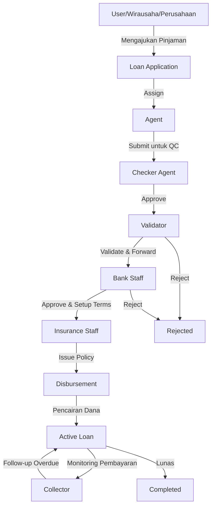

# Lendana Financial Access Platform - Workflow Overview

## 📋 Daftar Isi
- [Ringkasan Sistem](#ringkasan-sistem)
- [Arsitektur Aplikasi](#arsitektur-aplikasi)
- [Peran dan Tanggung Jawab](#peran-dan-tanggung-jawab)
- [Alur Kerja Utama](#alur-kerja-utama)
- [Fitur Keamanan](#fitur-keamanan)
- [Integrasi Database](#integrasi-database)

---

## 🎯 Ringkasan Sistem

**Lendana Financial Access Platform** adalah platform agregator teknologi finansial yang terdaftar di OJK (Otoritas Jasa Keuangan) untuk menghubungkan pengguna dengan layanan keuangan dan penyaluran KUR (Kredit Usaha Rakyat).

### Tujuan Utama:
- Menyediakan akses finansial kepada berbagai segmen masyarakat
- Menghubungkan peminjam dengan bank mitra (BNI, Mandiri, BRI, BTN, Bank Nano, BPR)
- Memfasilitasi proses pengajuan dan persetujuan pinjaman
- Mengelola siklus hidup pinjaman dari aplikasi hingga penagihan

---

## 🏗️ Arsitektur Aplikasi

### Tech Stack:
- **Frontend**: React + TypeScript + Vite
- **UI Framework**: Tailwind CSS + ShadCN UI Components
- **Routing**: React Router v6
- **Backend**: Supabase (PostgreSQL + Auth + Storage)
- **State Management**: React Hooks (useState, useEffect)

### Struktur Folder Utama:
```
src/
├── components/          # Komponen UI
│   ├── auth/           # Autentikasi
│   ├── pmi/            # Dashboard per role
│   └── ui/             # ShadCN components
├── lib/                # Utilities & Supabase client
├── hooks/              # Custom React hooks
└── types/              # TypeScript definitions
```

---

## 👥 Peran dan Tanggung Jawab

### 1. **User (Peminjam Umum)** 
**Role Code**: `user`

**Akses Dashboard**: `UserDashboard`

**Tanggung Jawab**:
- Mengajukan aplikasi pinjaman KUR
- Melengkapi dokumen persyaratan (KTP, KK, NPWP, dll)
- Memantau status aplikasi pinjaman
- Melihat riwayat pengajuan
- Mengelola profil pribadi

**Fitur Khusus**:
- Form pengajuan pinjaman dengan validasi lengkap
- Upload dokumen pendukung
- Timeline tracking status aplikasi
- Notifikasi perubahan status

---

### 2. **Wirausaha (Pengusaha Kecil)**
**Role Code**: `wirausaha`

**Akses Dashboard**: `UserDashboard` (dengan flag `isWirausaha=true`)

**Tanggung Jawab**:
- Sama seperti User, namun dengan kategori khusus untuk UKM
- Mengajukan pinjaman untuk usaha kecil menengah
- Menyediakan dokumen usaha tambahan

**Perbedaan dengan User**:
- Kategori pinjaman fokus pada pengembangan usaha
- Persyaratan dokumen tambahan terkait usaha
- Limit pinjaman yang berbeda

---

### 3. **Perusahaan (P3MI - Perusahaan Penempatan PMI)**
**Role Code**: `perusahaan`

**Akses Dashboard**: `P3MIBusinessLoanForm`

**Tanggung Jawab**:
- Mengajukan pinjaman bisnis untuk penempatan PMI
- Mengelola data perusahaan
- Mengajukan pinjaman untuk calon PMI yang akan ditempatkan

**Fitur Khusus**:
- Form pinjaman bisnis P3MI
- Manajemen data calon PMI
- Tracking penempatan PMI

---

### 4. **Agent (Agen Lapangan)**
**Role Code**: `agent`

**Akses Dashboard**: `AgentDashboard`

**Tanggung Jawab**:
- Membantu user dalam proses pengajuan pinjaman
- Melakukan verifikasi dokumen awal
- Mengumpulkan data peminjam di lapangan
- Menginput aplikasi pinjaman atas nama user
- Melakukan follow-up dengan peminjam

**Relasi Database**:
- Terhubung dengan `agent_companies` (perusahaan agen)
- Record di tabel `agent_staff`
- Dapat di-assign ke aplikasi pinjaman tertentu

**Workflow**:
1. Bertemu dengan calon peminjam
2. Membantu mengisi formulir aplikasi
3. Mengumpulkan dan memverifikasi dokumen
4. Submit aplikasi ke sistem
5. Follow-up status dengan peminjam

---

### 5. **Checker Agent (Agen Pemeriksa)**
**Role Code**: `checker_agent`

**Akses Dashboard**: `AgentDashboard` (dengan flag `isCheckerAgent=true`)

**Tanggung Jawab**:
- Melakukan quality control terhadap aplikasi yang disubmit agent
- Memverifikasi kelengkapan dan keakuratan data
- Menyetujui atau menolak aplikasi sebelum diteruskan ke validator
- Memberikan feedback kepada agent

**Perbedaan dengan Agent**:
- Tidak mengajukan aplikasi baru
- Fokus pada review dan approval
- Level akses lebih tinggi untuk edit data

---

### 6. **Validator (Tim Validasi Lendana)**
**Role Code**: `validator`

**Akses Dashboard**: `ValidatorDashboard`

**Tanggung Jawab**:
- Melakukan validasi mendalam terhadap aplikasi pinjaman
- Memeriksa kelengkapan dokumen
- Melakukan credit scoring
- Memutuskan kelayakan aplikasi
- Meneruskan aplikasi yang disetujui ke bank

**Workflow**:
1. Menerima aplikasi dari checker agent
2. Review dokumen dan data peminjam
3. Melakukan analisis kelayakan kredit
4. Memberikan rekomendasi (Approve/Reject)
5. Forward ke bank staff jika disetujui

**Kriteria Validasi**:
- Kelengkapan dokumen
- Keakuratan data
- Credit history
- Kemampuan bayar
- Jaminan (jika ada)

---

### 7. **Bank Staff (Staf Bank Mitra)**
**Role Code**: `bank_staff`

**Akses Dashboard**: `BankStaffDashboard`

**Tanggung Jawab**:
- Menerima aplikasi yang sudah divalidasi
- Melakukan final approval dari sisi bank
- Menentukan suku bunga dan tenor
- Proses pencairan dana
- Monitoring pembayaran

**Relasi Database**:
- Terhubung dengan `banks` (bank mitra)
- Terhubung dengan `bank_branches` (cabang bank)
- Record di tabel `bank_staff`

**Workflow**:
1. Review aplikasi yang diteruskan validator
2. Melakukan due diligence tambahan
3. Approve/reject dengan alasan
4. Setup loan terms (bunga, tenor, cicilan)
5. Proses pencairan
6. Monitoring repayment

---

### 8. **Insurance (Staf Asuransi)**
**Role Code**: `insurance`

**Akses Dashboard**: `InsuranceDashboard`

**Tanggung Jawab**:
- Mengelola polis asuransi untuk pinjaman
- Melakukan underwriting asuransi kredit
- Proses klaim jika terjadi default
- Monitoring coverage

**Relasi Database**:
- Terhubung dengan `insurance_companies`
- Record di tabel `insurance_staff`
- Terhubung dengan `insurance_policies`

**Workflow**:
1. Menerima notifikasi aplikasi yang disetujui bank
2. Melakukan assessment risiko
3. Issue polis asuransi
4. Monitoring klaim
5. Settlement klaim jika diperlukan

---

### 9. **Collector (Penagih)**
**Role Code**: `collector`

**Akses Dashboard**: `CollectorDashboard`

**Tanggung Jawab**:
- Monitoring pembayaran cicilan
- Melakukan penagihan untuk pembayaran yang terlambat
- Follow-up dengan peminjam yang menunggak
- Reporting status penagihan
- Negosiasi restrukturisasi jika diperlukan

**Relasi Database**:
- Terhubung dengan `collector_companies`
- Record di tabel `collector_staff`
- Terhubung dengan `collection_activities`

**Workflow**:
1. Monitoring due dates pembayaran
2. Reminder sebelum jatuh tempo
3. Follow-up untuk pembayaran terlambat
4. Kunjungan lapangan jika diperlukan
5. Reporting ke bank dan Lendana

---

### 10. **Admin (Administrator Sistem)**
**Role Code**: `admin`

**Akses Dashboard**: Full system access

**Tanggung Jawab**:
- Mengelola seluruh user dan role
- Konfigurasi sistem
- Manajemen bank mitra
- Manajemen produk pinjaman
- Monitoring sistem secara keseluruhan
- Akses ke semua dashboard
- User access matrix management

**Fitur Khusus**:
- User management (create, edit, delete)
- Bank management
- Product configuration
- System settings
- Audit logs
- Reports & analytics

---

## 🔄 Alur Kerja Utama

### A. Alur Pengajuan Pinjaman (User Flow)

```
1. USER REGISTRATION & LOGIN
   ├─ User mendaftar dengan email/password
   ├─ Pilih role (user/wirausaha/perusahaan)
   ├─ Verifikasi email
   └─ Login ke dashboard

2. PENGAJUAN APLIKASI
   ├─ User mengisi form aplikasi pinjaman
   │  ├─ Data pribadi
   │  ├─ Data pekerjaan
   │  ├─ Data pinjaman (jumlah, tenor, tujuan)
   │  └─ Upload dokumen
   ├─ Submit aplikasi
   └─ Status: "Pending" → Menunggu review agent

3. REVIEW AGENT
   ├─ Agent menerima notifikasi aplikasi baru
   ├─ Review kelengkapan data dan dokumen
   ├─ Assign ke checker agent
   └─ Status: "Under Review by Agent"

4. QUALITY CHECK
   ├─ Checker Agent melakukan QC
   ├─ Verifikasi keakuratan data
   ├─ Approve atau return ke agent untuk perbaikan
   └─ Status: "Approved by Checker" → Forward ke validator

5. VALIDASI
   ├─ Validator melakukan analisis mendalam
   ├─ Credit scoring
   ├─ Keputusan: Approve/Reject
   └─ Status: "Validated" → Forward ke bank

6. BANK APPROVAL
   ├─ Bank Staff review aplikasi
   ├─ Final approval dari bank
   ├─ Setup loan terms
   └─ Status: "Approved by Bank"

7. INSURANCE PROCESSING
   ├─ Insurance staff issue polis
   ├─ Coverage setup
   └─ Status: "Insured"

8. PENCAIRAN
   ├─ Bank proses pencairan dana
   ├─ Transfer ke rekening peminjam
   └─ Status: "Disbursed"

9. REPAYMENT & COLLECTION
   ├─ Peminjam melakukan pembayaran cicilan
   ├─ Collector monitoring pembayaran
   ├─ Follow-up jika terlambat
   └─ Status: "Active" / "Completed" / "Overdue"
```

### B. Status Aplikasi Pinjaman

| Status | Deskripsi | Role yang Menangani |
|--------|-----------|---------------------|
| `pending` | Aplikasi baru disubmit | Agent |
| `under_review` | Sedang direview agent | Agent |
| `checked` | Sudah di-QC checker agent | Checker Agent |
| `validated` | Sudah divalidasi | Validator |
| `approved_by_bank` | Disetujui bank | Bank Staff |
| `insured` | Sudah ada polis asuransi | Insurance |
| `disbursed` | Dana sudah dicairkan | Bank Staff |
| `active` | Pinjaman aktif, cicilan berjalan | Collector |
| `completed` | Pinjaman lunas | - |
| `rejected` | Ditolak | Validator/Bank Staff |
| `overdue` | Pembayaran terlambat | Collector |

---

## 🔐 Fitur Keamanan

### 1. **Auto Logout (Idle Timeout)**
- **Durasi**: 10 menit tanpa aktivitas
- **Cara Kerja**: 
  - Mendeteksi aktivitas user (mouse, keyboard, scroll, touch)
  - Timer direset setiap ada aktivitas
  - Otomatis logout jika idle 10 menit
- **Implementasi**: Custom hook `useIdleTimeout`

### 2. **Role-Based Access Control (RBAC)**
- Setiap role hanya bisa akses dashboard dan fitur sesuai haknya
- Protected routes dengan redirect otomatis
- API calls dibatasi berdasarkan role

### 3. **Supabase Authentication**
- Email/password authentication
- Row Level Security (RLS) di database
- JWT token untuk session management

### 4. **Data Protection**
- Dokumen sensitif disimpan di Supabase Storage dengan access control
- Password di-hash dengan bcrypt
- HTTPS untuk semua komunikasi

---

## 💾 Integrasi Database

### Tabel Utama:

#### 1. **users**
```sql
- id (uuid, primary key)
- email (text)
- full_name (text)
- role (text) -- user, agent, validator, dll
- created_at (timestamp)
```

#### 2. **loan_applications**
```sql
- id (uuid, primary key)
- user_id (uuid, foreign key → users)
- assigned_agent_id (uuid, foreign key → users)
- status (text)
- loan_amount (numeric)
- loan_purpose (text)
- employment_status (text)
- monthly_income (numeric)
- transaction_id (text) -- untuk tracking
- ip_address (text) -- untuk audit
- created_at (timestamp)
```

#### 3. **agent_companies**
```sql
- id (uuid, primary key)
- name (text)
- address (text)
- phone (text)
```

#### 4. **agent_staff**
```sql
- id (uuid, primary key)
- user_id (uuid, foreign key → users)
- agent_company_id (uuid, foreign key → agent_companies)
- position (text)
```

#### 5. **banks**
```sql
- id (uuid, primary key)
- name (text)
- code (text)
- logo_url (text)
```

#### 6. **bank_branches**
```sql
- id (uuid, primary key)
- bank_id (uuid, foreign key → banks)
- name (text)
- address (text)
```

#### 7. **bank_staff**
```sql
- id (uuid, primary key)
- user_id (uuid, foreign key → users)
- bank_id (uuid, foreign key → banks)
- branch_id (uuid, foreign key → bank_branches)
```

#### 8. **insurance_companies**
```sql
- id (uuid, primary key)
- name (text)
- address (text)
```

#### 9. **insurance_staff**
```sql
- id (uuid, primary key)
- user_id (uuid, foreign key → users)
- insurance_company_id (uuid, foreign key → insurance_companies)
```

#### 10. **collector_companies**
```sql
- id (uuid, primary key)
- name (text)
- address (text)
```

#### 11. **collector_staff**
```sql
- id (uuid, primary key)
- user_id (uuid, foreign key → users)
- collector_company_id (uuid, foreign key → collector_companies)
```

#### 12. **bank_products**
```sql
- id (uuid, primary key)
- bank_id (uuid, foreign key → banks)
- product_name (text)
- product_type (text) -- PMI, Livestock, Farmers, SME, Housing
- interest_rate (numeric)
- max_loan_amount (numeric)
- max_tenor_months (integer)
- description (text)
```

#### 13. **komponen_biaya**
```sql
- id (uuid, primary key)
- loan_application_id (uuid, foreign key → loan_applications)
- komponen (text)
- jumlah (numeric)
```

---

## 📊 Diagram Alur Sistem



---

## 🎨 Branding & UI

### Color Palette:
- **Primary Blue**: `#5680E9`
- **Light Blue**: `#84CEEB`
- **Sky Blue**: `#5AB9EA`
- **Soft Blue**: `#C1C8E4`
- **Purple**: `#8860D0`

### Typography:
- Clean, modern sans-serif fonts
- Black text untuk readability
- Consistent spacing dan hierarchy

### Components:
- ShadCN UI untuk konsistensi
- Responsive design untuk mobile & desktop
- Accessible (WCAG compliant)

---

## 📞 Kontak & Support

**PT. Lendana Digitalindo Nusantara**
- **Status**: Terdaftar di OJK sebagai Platform Agregator Teknologi Finansial
- **Call Center**: [Nomor Call Center]
- **Email**: [Email Support]
- **Alamat Kantor**: [Alamat Lengkap]

---

## 🚀 Deployment & Environment

### Environment Variables:
```
SUPABASE_PROJECT_ID
SUPABASE_URL
SUPABASE_ANON_KEY
SUPABASE_SERVICE_KEY
VITE_SUPABASE_URL
VITE_SUPABASE_ANON_KEY
```

### Deployment URL:
```
https://02766cf7-78e0-4c71-824d-7aa0faaa8b8c.canvases.tempo.build
```

---

## 📝 Catatan Pengembangan

### Fitur yang Sudah Diimplementasi:
✅ Multi-role authentication system
✅ Role-based dashboards
✅ Loan application workflow
✅ Document upload & management
✅ Status tracking & timeline
✅ Auto logout (idle timeout)
✅ Transaction tracking
✅ User access matrix
✅ Bank management
✅ Partner banks display
✅ Product tabs navigation

### Roadmap Pengembangan:
- [ ] Email notifications
- [ ] SMS notifications
- [ ] Payment gateway integration
- [ ] Credit scoring automation
- [ ] Mobile app (React Native)
- [ ] Advanced analytics & reporting
- [ ] API untuk integrasi pihak ketiga
- [ ] Chatbot customer support

---

**Dokumen ini dibuat untuk memberikan pemahaman menyeluruh tentang workflow dan peran dalam Lendana Financial Access Platform.**

*Last Updated: 2024*
